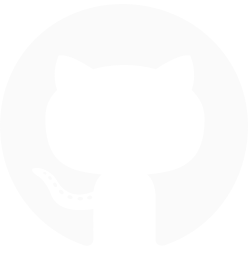
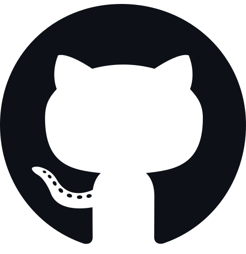

<!-- Banner  -->

<!--  views/stars/followers -->
 

<a href="https://github.com/jhoncarlnayao">
   
</a>
<a href="https://api.github-star-counter.workers.dev/user/jhoncarlnayao">
   
</a>

 

**Who Am I?**

IT student at the University of Mindanao. I got into tech because I was genuinely curious — not because someone told me to.
Design pulled me in early. There's something satisfying about making things look good and actually work. I lean heavily toward the Front-End side of things, 
where I can mess around with visuals, interactions, and the little details most people don't notice — but feel.
UI/UX is where I spend most of my headspace. Clean layouts, intentional spacing, interfaces that just feel right. That's the stuff I care about.

 

<!-- Gif  -->
 

<!-- A Little More About Me -->
 <h3 align="center">
  
  A Little More About Me 
  
 </h3>

⬛ I enjoy being around more experienced developers who inspire me to grow.  
⬜ Currently working on web development projects using **Laravel** and 
⬛ Always willing to help others who want to learn more about **Front-End** and **UI/UX**.  
⬛ Minimalism enthusiast.  
⬜ Passionate about designing modern, user-friendly interfaces that connect functionality with visual design.

  <!-- spotify and more --> 
  
 

  
   
  

  

 

<!-- github status
<h3 align="center">

 Github Status 

</h3>
 
-->

<!-- Academic Training
<h3 align="center">

 Academic Training

</h3>
 

<!-- Academic Badge-->

<!-- My Tech Stack -->

<!--- <h3 align="center">
 
 My Tech Stack
 
</h3>

 

     
     
     
     
     

 
-->

<!-- My Best Repositories -->

  

